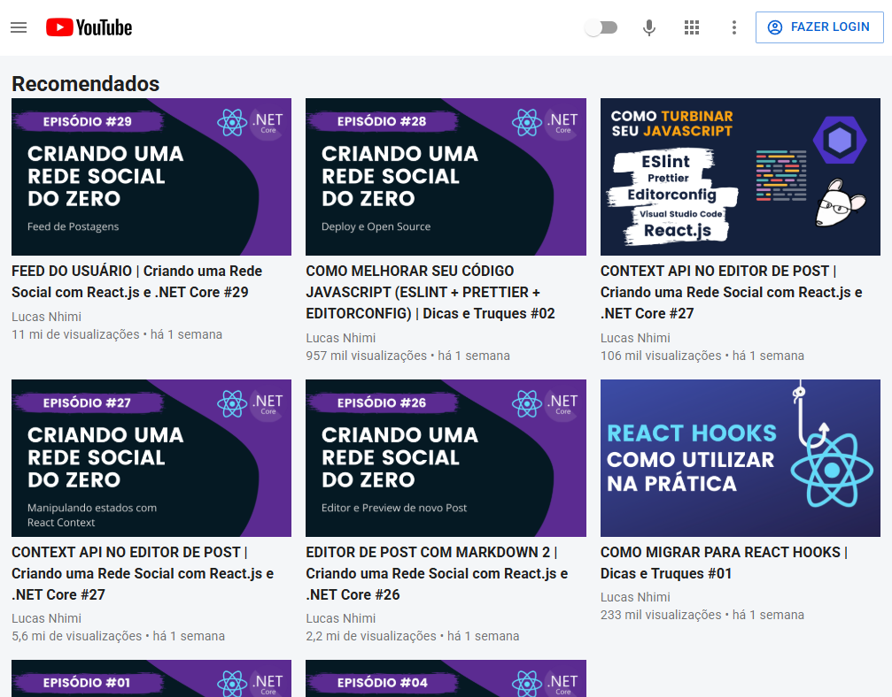

<h1 align="center">
  🎥 Youtube Material-UI
</h1>

  

<h4 align="center"><a href="https://clone-youtubemui.netlify.app/" target="_blank">Clique para visitar o projeto</a></h4>

## 📚 Sobre o projeto

Esse foi um projeto do canal <strong>Wazana</strong>, é um clone da interface do Youtube, usando React.js com Material UI. Resolvi fazer esse projeto na intenção de conhecer e aprender um pouco sobre o Material UI. 🚀

## 🛠️ Tecnologias utilizadas

- React.JS
- Material-UI

## 🔗 Link do vídeo

<a href="https://www.youtube.com/watch?v=u9FnmBdBl5k" target="_blank">Clique para visitar a aula</a>
